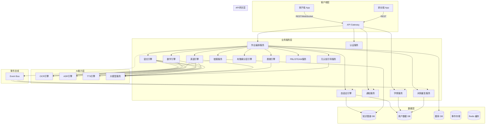
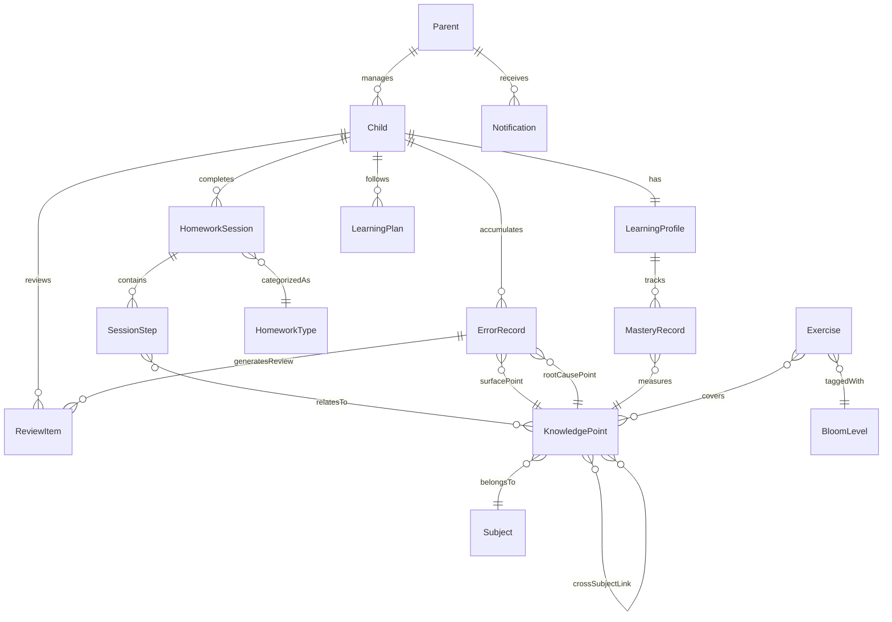

# 设计文档：K12家庭作业AI辅导产品

## 概述

本设计文档描述K12家庭作业AI辅导产品的技术架构与实现方案。产品面向小学3-6年级学段，覆盖语文、数学、英语三大学科共15类高频作业，融合苏格拉底式引导、费曼学习法、间隔重复、布鲁姆认知分层等八大核心学习法。

系统核心理念为"孩子做、AI盯、产品催、家长看"，通过多模态AI技术（OCR、ASR、TTS、大模型）实现作业的完整闭环流程：录入→引导执行→实时反馈→错题沉淀→学情更新。

### 关键设计决策

1. **微服务架构**：各学科引擎、学习法引擎、多模态服务独立部署，便于独立扩展和迭代
2. **事件驱动**：学习活动产生的数据通过事件总线异步传播，解耦各子系统
3. **知识图谱中心化**：所有学科内容、题目、错题均通过知识图谱关联，支撑溯源和自适应推荐
4. **大模型+规则引擎混合**：苏格拉底式引导和费曼对话由大模型驱动，批改和自适应调度由规则引擎+ML模型驱动
5. **离线优先**：核心批改和练习功能支持离线使用，联网后同步数据

---

## 架构

### 系统架构图



### 分层说明

| 层级 | 职责 | 关键技术 |
|------|------|----------|
| 客户端层 | 孩子端学习交互、家长端学情查看 | React Native / Flutter，离线缓存 |
| API网关层 | 认证鉴权、限流、路由 | Kong / AWS API Gateway |
| 业务服务层 | 作业编排、学科引擎、学习法引擎 | Node.js / Python，gRPC内部通信 |
| AI能力层 | OCR、ASR、TTS、大模型推理 | 自研+第三方API，GPU推理集群 |
| 数据层 | 知识图谱、用户数据、题库 | Neo4j、PostgreSQL、Redis |
| 事件总线 | 异步事件传播、数据同步 | Kafka / RabbitMQ |

---

## 组件与接口

### 1. 作业编排服务（Homework Orchestrator）

作业编排服务是系统的核心调度器，负责管理作业的完整生命周期。

```typescript
interface HomeworkOrchestrator {
  // 创建作业会话
  createSession(req: CreateSessionRequest): Promise<HomeworkSession>;
  // 提交作业步骤结果
  submitStep(sessionId: string, step: StepSubmission): Promise<StepFeedback>;
  // 获取下一步引导
  getNextGuidance(sessionId: string): Promise<GuidanceResponse>;
  // 完成作业会话
  completeSession(sessionId: string): Promise<SessionSummary>;
}

interface CreateSessionRequest {
  childId: string;
  subjectType: 'chinese' | 'math' | 'english';
  homeworkType: HomeworkType;
  inputMethod: 'photo' | 'online' | 'system_generated';
  imageUrls?: string[];       // 拍照录入时的图片
  curriculumUnitId?: string;  // 课程单元ID
}

type HomeworkType =
  // 语文
  | 'dictation' | 'recitation' | 'reading_comprehension' | 'composition' | 'poetry'
  // 数学
  | 'calculation' | 'word_problem' | 'unit_test' | 'concept_quiz' | 'math_challenge'
  // 英语
  | 'spelling' | 'oral_reading' | 'grammar' | 'writing' | 'oral_dialogue';

interface StepSubmission {
  stepId: string;
  answerType: 'text' | 'image' | 'audio';
  content: string;            // 文本内容或Base64编码
  metadata?: Record<string, unknown>;
}

interface StepFeedback {
  isCorrect: boolean | null;  // null表示开放性题目
  feedbackType: 'encouragement' | 'hint' | 'correction' | 'explanation';
  message: string;            // 鼓励式反馈文本
  nextStepId?: string;
  visualAids?: VisualAid[];   // 可视化辅助（笔顺动画、数轴图等）
  socraticQuestion?: string;  // 苏格拉底式追问
}
```

### 2. 学科引擎接口

三大学科引擎共享统一的基础接口，各自扩展学科特有能力。

```typescript
interface SubjectEngine {
  // 解析作业内容
  parseHomework(input: HomeworkInput): Promise<ParsedHomework>;
  // 批改答案
  gradeAnswer(question: Question, answer: Answer): Promise<GradeResult>;
  // 生成引导提示
  generateGuidance(context: GuidanceContext): Promise<GuidanceResponse>;
  // 生成练习题
  generateExercise(params: ExerciseParams): Promise<Exercise[]>;
}

interface GradeResult {
  isCorrect: boolean;
  score?: number;                    // 0-100
  errorType?: string;                // 错误分类
  errorDetail?: string;              // 错误详情
  knowledgePointIds: string[];       // 关联知识点
  bloomLevel: BloomLevel;            // 布鲁姆认知层级
  correctAnswer?: string;            // 正确答案（仅内部使用，不直接展示给孩子）
}

type BloomLevel = 'remember' | 'understand' | 'apply' | 'analyze' | 'evaluate' | 'create';
```

### 3. OCR引擎接口

```typescript
interface OCREngine {
  // 识别图片中的文字
  recognize(image: ImageInput): Promise<OCRResult>;
  // 识别手写数学公式
  recognizeMathFormula(image: ImageInput): Promise<MathFormulaResult>;
  // 识别试卷结构
  recognizeExamPaper(images: ImageInput[]): Promise<ExamPaperResult>;
}

interface OCRResult {
  blocks: TextBlock[];
  overallConfidence: number;
  lowConfidenceRegions: BoundingBox[];  // 低置信度区域，需用户确认
}

interface TextBlock {
  text: string;
  confidence: number;
  boundingBox: BoundingBox;
  contentType: 'printed' | 'handwritten';
  scriptType: 'chinese' | 'english' | 'math_formula';
}
```

### 4. ASR/TTS引擎接口

```typescript
interface ASREngine {
  // 语音评测
  evaluate(audio: AudioInput, referenceText: string, language: 'zh' | 'en'): Promise<PronunciationResult>;
  // 实时语音识别
  transcribe(audioStream: ReadableStream, language: 'zh' | 'en'): AsyncGenerator<TranscriptSegment>;
}

interface PronunciationResult {
  overallScore: number;           // 0-100
  fluencyScore: number;
  accuracyScore: number;
  intonationScore: number;
  wordScores: WordPronunciationScore[];
  errorPhonemes: PhonemeError[];  // 错误音素列表
}

interface TTSEngine {
  // 文本转语音
  synthesize(text: string, options: TTSOptions): Promise<AudioOutput>;
}

interface TTSOptions {
  language: 'zh' | 'en';
  speed: 'slow' | 'normal' | 'fast';
  voice?: string;                 // 音色选择
}
```

### 5. 大模型服务接口

```typescript
interface LLMService {
  // 苏格拉底式引导对话
  socraticDialogue(context: DialogueContext): Promise<DialogueResponse>;
  // 语义比对评分
  semanticCompare(answer: string, reference: string, rubric: string): Promise<SemanticScore>;
  // 作文评价
  evaluateComposition(text: string, criteria: CompositionCriteria): Promise<CompositionEvaluation>;
  // 费曼对话
  feynmanDialogue(context: FeynmanContext): Promise<DialogueResponse>;
  // 元认知提示生成
  generateMetacognitivePrompt(learningContext: LearningContext): Promise<string>;
}

interface DialogueContext {
  childId: string;
  childGrade: number;
  conversationHistory: Message[];
  currentQuestion: Question;
  childAnswer?: string;
  knowledgeContext: string;       // 相关知识点上下文
  guidanceLevel: number;         // 引导层级（0=最少提示，3=最多提示）
}

interface DialogueResponse {
  message: string;                // AI回复文本
  responseType: 'question' | 'hint' | 'encouragement' | 'summary';
  suggestedNextAction?: string;
}
```

### 6. 错题服务接口

```typescript
interface ErrorBookService {
  // 记录错题
  recordError(error: ErrorRecord): Promise<void>;
  // 溯源分析
  traceRootCause(errorId: string): Promise<RootCauseAnalysis>;
  // 聚合分析
  aggregateErrors(childId: string, filters: ErrorFilters): Promise<ErrorAggregation>;
  // 生成变式题
  generateVariant(errorId: string): Promise<Exercise>;
  // 标记已掌握
  markMastered(childId: string, knowledgePointId: string): Promise<void>;
}

interface RootCauseAnalysis {
  surfaceKnowledgePoint: KnowledgePoint;   // 表面知识点
  rootKnowledgePoint: KnowledgePoint;      // 根本薄弱知识点
  prerequisiteChain: KnowledgePoint[];     // 前置知识链
  suggestedExercises: Exercise[];          // 建议练习
}
```

### 7. 间隔重复服务接口

```typescript
interface SpacedRepetitionService {
  // 获取今日复习列表
  getTodayReviewList(childId: string): Promise<ReviewItem[]>;
  // 提交复习结果
  submitReviewResult(reviewId: string, difficulty: 'easy' | 'medium' | 'hard'): Promise<void>;
  // 添加复习项
  addReviewItem(item: NewReviewItem): Promise<void>;
  // 获取遗忘模型参数
  getForgettingModel(childId: string): Promise<ForgettingModelParams>;
}

interface ReviewItem {
  reviewId: string;
  contentType: 'character' | 'word' | 'poetry' | 'formula' | 'concept';
  content: string;
  lastReviewDate: Date;
  nextReviewDate: Date;
  repetitionCount: number;
  easeFactor: number;            // SM-2算法的易度因子
}
```

### 8. 自适应引擎接口

```typescript
interface AdaptiveEngine {
  // 计算知识点掌握度
  calculateMastery(childId: string, knowledgePointId: string): Promise<MasteryLevel>;
  // 生成学习计划
  generateLearningPlan(childId: string, date: Date): Promise<LearningPlan>;
  // 选择适配难度题目
  selectExercise(childId: string, knowledgePointId: string): Promise<Exercise>;
  // 调整难度
  adjustDifficulty(childId: string, performanceData: PerformanceData): Promise<DifficultyAdjustment>;
}

interface LearningPlan {
  childId: string;
  date: Date;
  estimatedDuration: number;     // 预计时长（分钟），不超过45
  tasks: PlannedTask[];
  reviewItems: ReviewItem[];
  priorityWeakPoints: KnowledgePoint[];
}

interface DifficultyAdjustment {
  currentLevel: number;          // 1-10
  newLevel: number;
  reason: 'consecutive_correct' | 'consecutive_wrong' | 'mastery_update';
  prerequisiteExercises?: Exercise[];  // 降级时补充的前置练习
}
```

### 9. 学情服务接口

```typescript
interface LearningProfileService {
  // 获取学情档案
  getProfile(childId: string): Promise<LearningProfile>;
  // 更新学情数据
  updateProfile(childId: string, event: LearningEvent): Promise<void>;
  // 生成能力画像
  generateAbilityPortrait(childId: string): Promise<AbilityPortrait>;
  // 生成学情报告
  generateReport(childId: string, type: 'weekly' | 'monthly'): Promise<LearningReport>;
}

interface AbilityPortrait {
  subjectRadar: Record<string, number>;          // 学科能力雷达图数据
  knowledgeHeatmap: KnowledgeHeatmapData[];      // 知识点掌握热力图
  learningHabits: LearningHabitAnalysis;         // 学习习惯分析
  bloomDistribution: Record<BloomLevel, number>; // 各认知层级分布
  progressTrend: TrendData[];                    // 进步趋势
}
```

### 10. 家长通知服务接口

```typescript
interface NotificationService {
  // 推送任务完成通知
  pushTaskCompletion(parentId: string, summary: TaskSummary): Promise<void>;
  // 推送异常提醒
  pushAlert(parentId: string, alert: LearningAlert): Promise<void>;
  // 获取通知历史
  getNotificationHistory(parentId: string, pagination: Pagination): Promise<Notification[]>;
}

interface LearningAlert {
  alertType: 'idle_too_long' | 'accuracy_drop' | 'time_limit_reached';
  childId: string;
  message: string;               // 家长易懂的语言描述
  timestamp: Date;
  severity: 'info' | 'warning';
}
```

---

## 数据模型

### 核心实体关系图



### 主要数据模型

```typescript
// ===== 用户模型 =====

interface Child {
  id: string;
  name: string;
  grade: number;                    // 3-6年级
  school?: string;
  parentIds: string[];
  curriculumBindings: CurriculumBinding[];  // 课程表绑定
  settings: ChildSettings;
  createdAt: Date;
}

interface ChildSettings {
  ttsSpeed: 'slow' | 'normal' | 'fast';
  dailyTimeLimitMinutes: number;    // 每日学习时长上限
  studyTimeSlots: TimeSlot[];       // 允许学习的时间段
  interactionStyle: 'gentle' | 'standard' | 'challenging';
}

interface Parent {
  id: string;
  name: string;
  childIds: string[];
  notificationPreferences: NotificationPreferences;
}

// ===== 作业会话模型 =====

interface HomeworkSession {
  id: string;
  childId: string;
  subjectType: 'chinese' | 'math' | 'english';
  homeworkType: HomeworkType;
  status: 'in_progress' | 'completed' | 'paused';
  steps: SessionStep[];
  startTime: Date;
  endTime?: Date;
  summary?: SessionSummary;
}

interface SessionStep {
  id: string;
  sessionId: string;
  stepType: 'question' | 'guidance' | 'correction' | 'review';
  question?: Question;
  childAnswer?: string;
  gradeResult?: GradeResult;
  guidanceHistory: Message[];       // 苏格拉底式对话历史
  knowledgePointIds: string[];
  bloomLevel: BloomLevel;
  duration: number;                 // 该步骤用时（秒）
  timestamp: Date;
}

interface SessionSummary {
  totalQuestions: number;
  correctCount: number;
  accuracy: number;
  totalDuration: number;
  errorTypes: Record<string, number>;
  knowledgePointsCovered: string[];
  weakPoints: string[];
  encouragementMessage: string;
}

// ===== 知识图谱模型 =====

interface KnowledgePoint {
  id: string;
  name: string;
  subject: 'chinese' | 'math' | 'english';
  grade: number;
  unit: string;                     // 教材单元
  category: string;                 // 知识分类
  prerequisites: string[];          // 前置知识点ID
  relatedPoints: string[];          // 关联知识点ID
  crossSubjectLinks: CrossSubjectLink[];
  bloomLevels: BloomLevel[];        // 可考查的认知层级
  difficulty: number;               // 1-10
}

interface CrossSubjectLink {
  targetPointId: string;
  linkType: string;                 // 关联类型描述
  description: string;
}

// ===== 错题模型 =====

interface ErrorRecord {
  id: string;
  childId: string;
  sessionId: string;
  question: Question;
  childAnswer: string;
  correctAnswer: string;
  errorType: string;
  surfaceKnowledgePointId: string;
  rootCauseKnowledgePointId?: string;
  status: 'new' | 'reviewing' | 'mastered';
  consecutiveCorrect: number;       // 连续正确次数
  createdAt: Date;
  lastReviewedAt?: Date;
}

// ===== 间隔重复模型 =====

interface ReviewItem {
  id: string;
  childId: string;
  contentType: 'character' | 'word' | 'poetry' | 'formula' | 'concept' | 'error_variant';
  content: string;
  referenceAnswer: string;
  sourceErrorId?: string;           // 来源错题ID
  knowledgePointId: string;
  // SM-2算法参数
  repetitionCount: number;
  easeFactor: number;               // 初始值2.5
  interval: number;                 // 当前间隔（天）
  nextReviewDate: Date;
  lastReviewDate?: Date;
  lastDifficulty?: 'easy' | 'medium' | 'hard';
}

// ===== 学情档案模型 =====

interface LearningProfile {
  childId: string;
  subjectProfiles: Record<string, SubjectProfile>;
  masteryRecords: MasteryRecord[];
  learningHabits: LearningHabitData;
  lastUpdated: Date;
}

interface MasteryRecord {
  knowledgePointId: string;
  masteryLevel: number;             // 0-100
  bloomMastery: Record<BloomLevel, number>;  // 各认知层级掌握度
  totalAttempts: number;
  correctAttempts: number;
  recentAccuracyTrend: number[];    // 最近10次正确率
  lastPracticeDate: Date;
}

interface SubjectProfile {
  subject: string;
  overallMastery: number;
  weakPoints: string[];             // 薄弱知识点ID列表
  strongPoints: string[];           // 优势知识点ID列表
  totalStudyMinutes: number;
  averageAccuracy: number;
}

// ===== 学习计划模型 =====

interface LearningPlan {
  id: string;
  childId: string;
  date: Date;
  estimatedDuration: number;        // 分钟，≤45
  tasks: PlannedTask[];
  status: 'pending' | 'in_progress' | 'completed';
}

interface PlannedTask {
  id: string;
  taskType: 'review' | 'new_learning' | 'error_correction' | 'deliberate_practice' | 'feynman' | 'pbl';
  subject: string;
  knowledgePointIds: string[];
  estimatedDuration: number;
  priority: number;
  bloomTargetLevel: BloomLevel;
}

// ===== 学情报告模型 =====

interface LearningReport {
  childId: string;
  reportType: 'weekly' | 'monthly';
  period: { start: Date; end: Date };
  studyTimeSummary: {
    totalMinutes: number;
    dailyAverage: number;
    bySubject: Record<string, number>;
  };
  progressSummary: {
    improvedPoints: KnowledgePointProgress[];
    declinedPoints: KnowledgePointProgress[];
    newlyMastered: string[];
  };
  weakPointAnalysis: {
    currentWeakPoints: WeakPointDetail[];
    suggestedActions: string[];
  };
  parentFriendlyNarrative: string;  // 家长易懂的文字总结
}
```

### 数据存储策略

| 数据类型 | 存储方案 | 理由 |
|----------|----------|------|
| 知识图谱 | Neo4j | 图数据库天然适合知识点关联关系查询和溯源分析 |
| 用户数据/学情档案 | PostgreSQL | 结构化数据，支持复杂查询和事务 |
| 作业会话/对话历史 | PostgreSQL + JSON列 | 会话数据结构化存储，对话历史用JSON灵活存储 |
| 题库 | PostgreSQL | 支持按知识点、难度、题型等多维度查询 |
| 间隔重复队列 | Redis + PostgreSQL | Redis做到期任务的快速查询，PostgreSQL持久化 |
| 事件流 | Kafka | 高吞吐异步事件处理 |
| 多媒体文件 | 对象存储（S3） | 图片、音频等大文件存储 |
| 缓存 | Redis | 热点数据缓存，如当日学习计划、知识点掌握度 |

---

## 新增组件设计（口头/书写差异化）

### 11. 作业分类管理服务

```typescript
interface HomeworkClassificationService {
  // 自动分类作业为口头/书写类型
  classifyHomework(content: string, subject: SubjectType): HomeworkCategory;
  // 生成差异化学习计划
  generateSchedule(childId: string, date: Date): DailySchedule;
  // 完成状态打卡
  checkIn(childId: string, taskId: string, method: 'tap' | 'photo' | 'voice'): Promise<void>;
}

type HomeworkCategory = 'oral' | 'written';

interface DailySchedule {
  childId: string;
  date: Date;
  oralTasks: ScheduledTask[];     // 碎片化安排
  writtenTasks: ScheduledTask[];  // 集中安排
  totalEstimatedMinutes: number;
}

interface ScheduledTask {
  taskId: string;
  category: HomeworkCategory;
  subject: SubjectType;
  description: string;
  scheduledTime: 'morning' | 'afternoon' | 'evening' | 'bedtime';
  estimatedMinutes: number;
  status: 'pending' | 'completed' | 'skipped';
}
```

### 12. 口头作业成果留存服务

```typescript
interface OralRecordingService {
  // 保存朗读/背诵音频
  saveRecording(childId: string, recording: AudioRecording): Promise<string>;
  // 获取成长音频集
  getGrowthCollection(childId: string, filters?: RecordingFilters): Promise<AudioRecording[]>;
  // 生成口头作业量化报告
  generateOralReport(childId: string, period: DateRange): Promise<OralAssessmentReport>;
}

interface AudioRecording {
  id: string;
  childId: string;
  type: 'reading' | 'recitation' | 'oral_math' | 'english_reading';
  audioUrl: string;
  duration: number;
  score: number;
  details: {
    fluencyScore: number;
    accuracyScore: number;
    missingWords: string[];
    stutterCount: number;
  };
  createdAt: Date;
}
```

### 13. 磨蹭治理与健康提醒服务

```typescript
interface FocusManagementService {
  // 启动分段计时
  startFocusTimer(childId: string, config: FocusTimerConfig): FocusSession;
  // 拆分任务为小任务
  splitIntoMicroTasks(task: HomeworkTask): MicroTask[];
  // 坐姿/护眼提醒
  getHealthReminder(childId: string, sessionDuration: number): HealthReminder | null;
  // 书写三维评分
  evaluateWriting(childId: string, metrics: WritingMetrics): WritingEvaluation;
}

interface FocusTimerConfig {
  focusMinutes: number;       // 专注时长（默认10分钟）
  breakMinutes: number;       // 休息时长（默认2分钟）
  totalRounds: number;        // 总轮数
}

interface WritingEvaluation {
  neatnessScore: number;      // 工整度 0-100
  accuracyScore: number;      // 正确率 0-100
  speedScore: number;         // 完成速度 0-100
  overallScore: number;
  positiveComment: string;    // 正向评语
}
```

### 14. 亲子陪辅服务

```typescript
interface ParentCoachingService {
  // 获取陪辅话术
  getCoachingScript(situation: ConflictSituation): CoachingScript;
  // 获取亲子互动任务
  getInteractiveTask(childId: string, category: HomeworkCategory): InteractiveTask;
  // 获取家长辅导教程
  getTutorial(topic: TutorialTopic, childGrade: number): Tutorial;
}

type ConflictSituation =
  | 'cant_recite' | 'reading_mistakes' | 'dawdling'
  | 'messy_writing' | 'too_many_errors' | 'refuses_homework';

interface CoachingScript {
  situation: string;
  wrongApproach: string;      // 错误示范
  rightApproach: string;      // 正确话术
  tips: string[];             // 额外建议
}

interface InteractiveTask {
  id: string;
  title: string;
  description: string;
  category: HomeworkCategory;
  steps: string[];
  estimatedMinutes: number;
  rewardPoints: number;
}
```

### 15. 学段分层适配引擎

```typescript
interface GradeAdaptationEngine {
  // 获取学段配置
  getGradeConfig(grade: number): GradeConfig;
  // 适配功能集
  getAvailableFeatures(grade: number): FeatureSet;
  // 适配内容难度
  adaptContent(content: string, fromGrade: number, toGrade: number): string;
}

type GradeBand = 'lower' | 'middle' | 'upper';  // 1-2 / 3-4 / 5-6

interface GradeConfig {
  band: GradeBand;
  maxSessionMinutes: number;
  focusIntervalMinutes: number;
  interactionStyle: 'playful' | 'guided' | 'independent';
  contentFocus: string[];     // 该学段侧重的内容类型
  uiComplexity: 'simple' | 'standard' | 'advanced';
}
```

